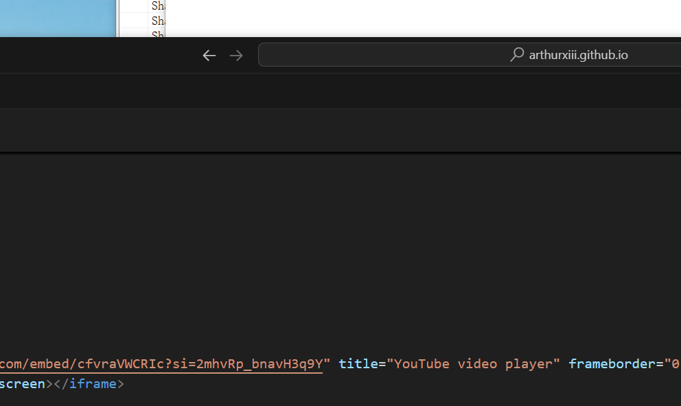

A sample blog page that demonstrates the inclusion of Tweets/Timelines/etc.

# Tweet

# 23

<iframe width="560" height="315" src="https://www.youtube.com/embed/Z8WsdEqap5w?si=VmS3L5LVLqxHf6UH" title="YouTube video player" frameborder="0" allow="accelerometer; autoplay; clipboard-write; encrypted-media; gyroscope; picture-in-picture; web-share" referrerpolicy="strict-origin-when-cross-origin" allowfullscreen></iframe>

# 4546

<iframe src="//player.bilibili.com/player.html?isOutside=true&aid=816339741&bvid=BV1hG4y1H7iZ&cid=853111277&p=1" scrolling="no" border="0" frameborder="no" framespacing="0" allowfullscreen="true"></iframe>

# First
第一条YouTube相关内容
<iframe width="560" height="315" src="https://www.youtube.com/embed/mfRkhNTh0xE?si=413mRjkBkE3KAqf2" title="YouTube video player" frameborder="0" allow="accelerometer; autoplay; clipboard-write; encrypted-media; gyroscope; picture-in-picture; web-share" referrerpolicy="strict-origin-when-cross-origin" allowfullscreen></iframe>

# second
第二条通过liquid代码的方式



# three
  直接嵌入上一条视频

  <iframe width="560" height="315" src="https://www.youtube.com/embed/cfvraVWCRIc?si=2mhvRp_bnavH3q9Y" title="YouTube video player" frameborder="0" allow="accelerometer; autoplay; clipboard-write; encrypted-media; gyroscope; picture-in-picture; web-share" referrerpolicy="strict-origin-when-cross-origin" allowfullscreen></iframe>

# four
   嵌入X里的内容

   <blockquote class="twitter-tweet">
<a href="https://t.co/QSNwbc6djo">pic.twitter.com/QSNwbc6djo</a>
&mdash; Elon Musk (@elonmusk) <a href="https://twitter.com/elonmusk/status/1927556425167085640?ref_src=twsrc%5Etfw">May 28, 2025</a></blockquote> 

# five



